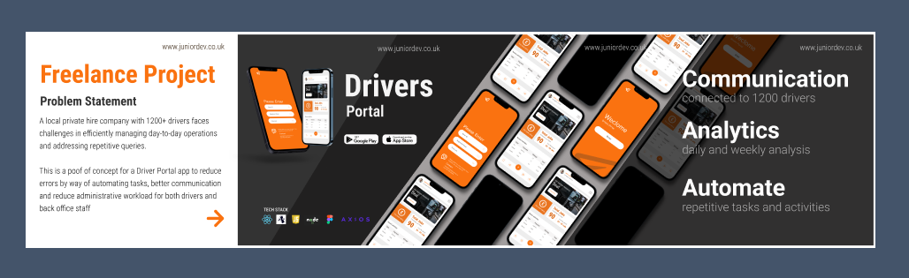
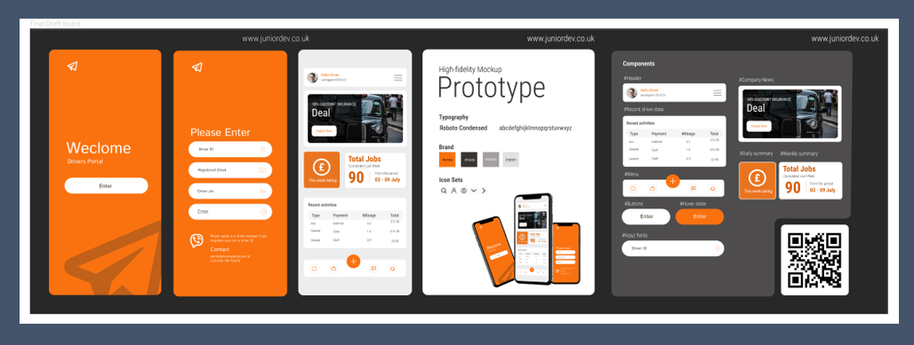
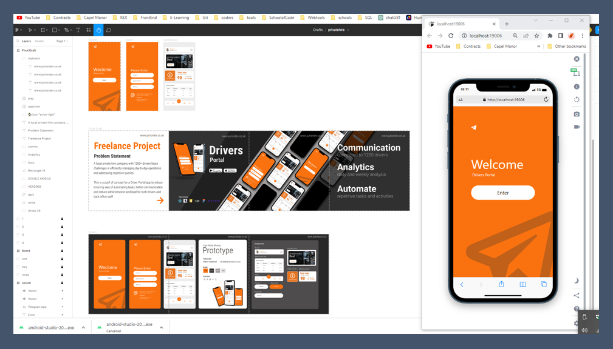
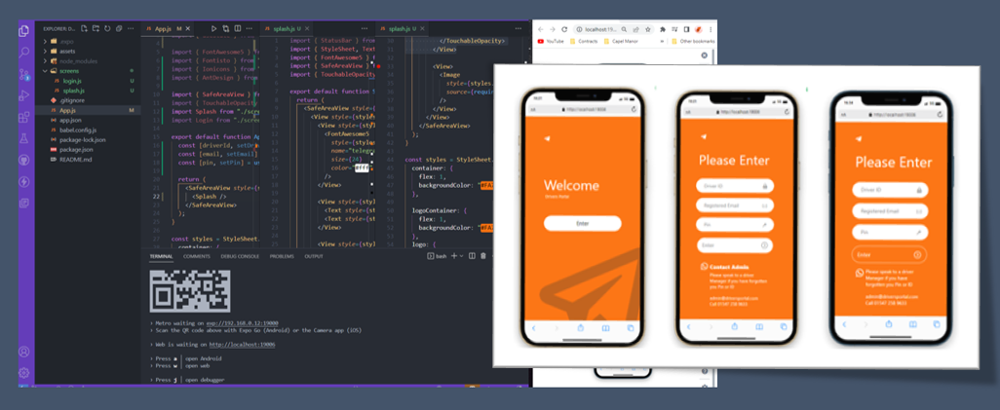
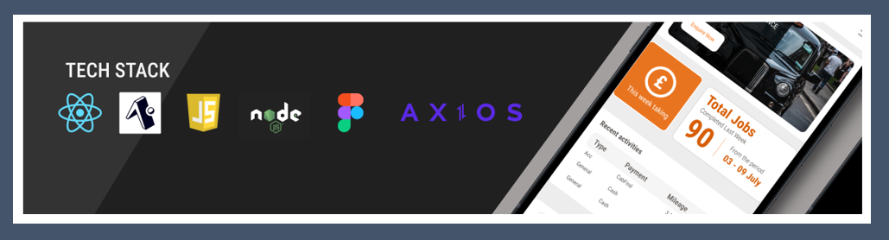
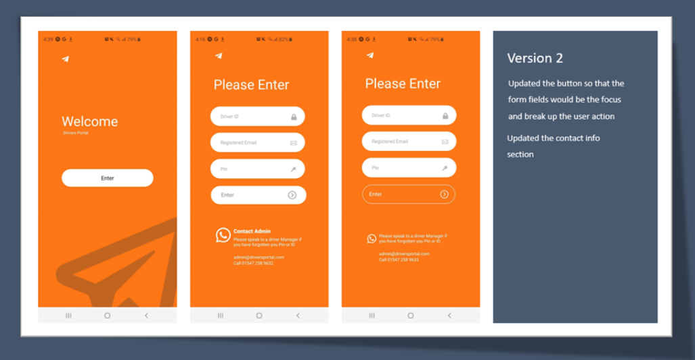

## Project Intro

A local private hire company with 1200+ drivers faces challenges in efficiently managing day-to-day operations and addressing repetitive queries. 

To optimize their processes, the company plans to develop a driver portal app. However, the lack of automation leads to delays, errors when sending out emails, and increased administrative workload.

The app aims to automate tasks and establish a dedicated drivers' portal. It will enable drivers to 

* access live information regarding completed jobs
* submit documents via the portal
* receive licensing updates and
* industry practice notifications. 

Additionally, it will provide daily and weekly job analyses to maximize driver's income potential. 

By streamlining communication and automating processes, the company aims to 

* enhance productivity
* collaboration with drivers,
* reducing administrative burden and
* improving operational efficiency.

## Figma UI Deign 

Having gathered all the requirements from discussions with the various users groups (back office admin, account team, drivers and driver manager) I detailed a proof of concept figma board to show and demonstrate the diffent screens (only 3 at this stage).  Also this allows for feedback and verify if I have captured the requirements and transerlated this into a viable product.

## Progress so far 

## Tech Stack 

Using React Native and Expo CLI, Node.js to manage dependencies, and grappling with using an Android emulator on my development machine whilst running the app on my phone to see the live updates is fun.  Moving and progressing with the proof of concept I can see you me using a range of other tech tools and libraires.  Where possible I’m trying to implement feature using core Native features.  Currently researching different dependencies to use for the dashboard such as Naviagtion, NavSwiper and axios to manage api fetch requests should be fun stay tuned.

## Android View

Well, after a few days of learning, reading documentation, and testing on various devices, and getting things to line up and just work behold my creation visible on a Samsung S20! It's the culmination of my React Native journey so far. Now it's time to gather all the components and make them work together like a well-rehearsed band.
Having only spent three days diving into React Native to build this proof of concept. Talk about a crash course! It has its tricky moments, especially when it comes to CSS. Let's just say the CSS in React Native can be a bit mischievous compared to its web app counterpart. But hey, we can't always have clean and tidy code, right? Sometimes we have to embrace the chaos and make it work! 

